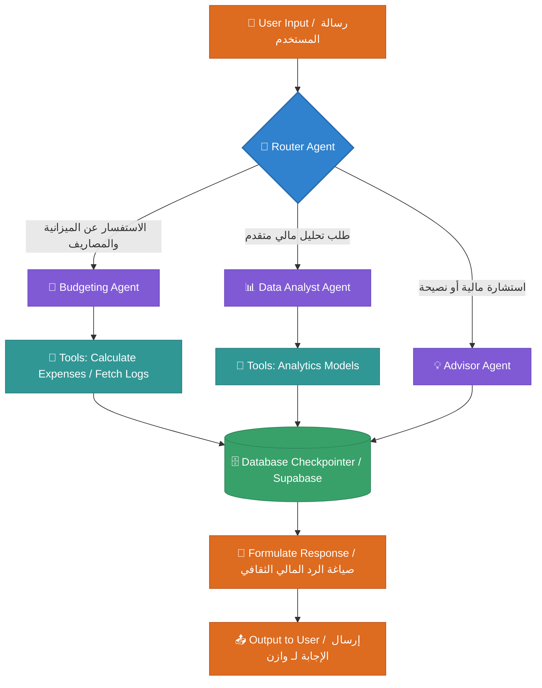

# Wazen | وازن

An Arabic-first, culturally aware conversational AI assistant that simplifies personal budgeting for Saudi individuals. Built using advanced multi-agent workflows and LangGraph to provide precise, secure, and smart financial insights.

**وازن** هو مساعد مالي ذكي مدعوم بالذكاء الاصطناعي التفاعلي، مصمم خصيصاً ليتناسب مع الثقافة والأنظمة المالية في المجتمع السعودي. يعتمد المشروع على بنية العُملاء المتعددين (Multi-Agent Architecture) لتوفير تحليلات وجدولة مالية دقيقة وآمنة.

---

##  Features | الميزات الأساسية

- **Culturally Aware AI:** Understands Saudi financial dialects, local banking terminologies, and monthly salary cycles (e.g., 27th of each Gregorian month).
- **Multi-Agent Architecture:** Powered by **LangGraph**, dividing tasks between dedicated agents (Data Analyst Agent, Budgeting Agent, and Advisor Agent) for maximum accuracy.
- **Secure Data Management:** Integrated with **Supabase** for secure user session persistence and encrypted financial logs.
- **Interactive Insights:** Provides automated expense tracking, smart budgeting recommendations, and predictive saving alerts.

---

##  Tech Stack | التقنيات المستخدمة

- **Core Logic & AI Framework:** Python, LangChain, LangGraph
- **Database & Authentication:** Supabase
- **Environment & Dependency Management:** `uv` / `pip`

---
##  Project Architecture | مخطط تدفق النظام الذكي



##  Repository Structure | هيكلة المستودع

```text
wazen/
├── data/                  # Evaluation datasets & analytics
├── docs/                  # Project documentation
├── supabase/              # Database schema & migrations
├── tests/                 # Unit tests for agents and backend
├── src/                   # Source code
    ├── agent/             # LangGraph state machine & AI agent logic
    ├── backend/           # FastAPI backend endpoints
    └── frontend/          # User Interface (Web/Mobile)
```
